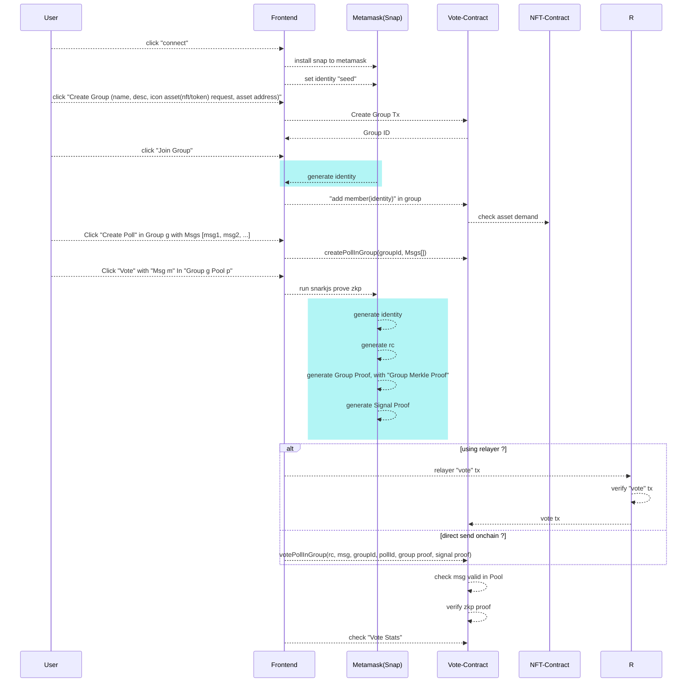

# Workflow



# Setup Snap
```shell
  git clone git@github.com:p0x-labs/zkVote-snap.git
  nvm use v16.16.0
  yarn install
  yarn build;yarn start
```

# Setup Frontend
```shell
  nvm use lts/hydrogen
  npm install
  npm run dev
```

# [Optional] Setup Relayer
see "using_relayer"

```shell
  cd backend
  ts-node relayer.ts
```

# TODO
1. Privacy Protect of Ethereum Address   
  offchain relayer VS EIP4337(still need realyer)
  refactor vote contract for a static verify interface.